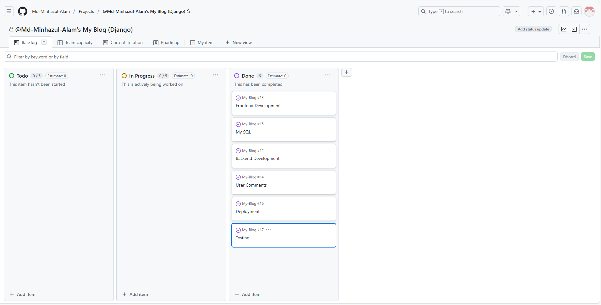

# [My Blog Django](https://minhazulmyblog-2071031bcb58.herokuapp.com/)

Developer: Md Minhazul Alam ([Md-Minhazul-Alam](https://github.com/Md-Minhazul-Alam))

[](https://github.com/Md-Minhazul-Alam/My-Blog-Django/commits/master)
[](https://github.com/Md-Minhazul-Alam/My-Blog-Django/commits/master)
[](https://github.com/Md-Minhazul-Alam/My-Blog-Django)

I’m Md Minhazul Alam, and this is my **third project** as part of my journey into **full-stack development programme**.
The project is an **data-driven blogging platform** developed with **Django (Python)** as the backend and a **responsive frontend** developed in HTML, CSS, Bootstrap and custom JavaScript.

It highlights my ability to model, develop CRUD, and map backend code to a clean, user-friendly interface.
The objective was to be **simple, responsive, and accessible** and show hands-on Python + Django development capability.

---

## The 5 Planes of UX 

### 1. Strategy
**Purpose**  
This blog site showcases my backend abilities while presenting a responsive, intuitive environment for posting, categorizing, and engaging with blogs.  

**Primary User Needs**  
- View blog entries by category or popularity  
- View posts with images and featured articles  
- Comment on posts, edit or delete them (if email authenticated)  

**Business Goals**  
- Demonstrate Django development skills
- Showcase a project that has real world blog features
- Act as an academic and portfolio piece

---

### 2. Scope
**Features**  
- Responsive navbar with sidebar on mobile  
- Search modal for quick content search  
- Social media integration in navbar and footer  
- Blog slider with recent posts  
- Category based sections admin select  
- Editor's choice and most viewed posts sidebar  
- Full CRUD for posts (admin)  
- Comment section with Add/edit/delete by user
- About, Contact Us and Privacy Policy
- Copyright

**Content Requirements**  
- Post titles, images, categories, tags  
- Featured sections defined by admin  
- Social links and brand identity/logo  

---

### 3. Structure
**Information Architecture**
- **Navigation Menu**: Logo (left), categories, search, social icons, mobile sidebar
- **Homepage**: Slider, latest blogs based on category selection, editor's choice, most viewed
- **Category Page**: Filtered posts, editor's choice, most viewed
- **Blog Details**: Post image, body, categories, comments section (Comment form, Edit & Dlete)
- **Footer**: About us, categories, quick links, social icons and copyright

**User Flow**
1. User lands on homepage → browse latest/featured blogs
2. Category navigation used → filtered blogs
3. Reads a blog post → editor's choice and most viewed
4. Posts a comment (with email for add/edit/delete)
5. Makes use of search modal or social links for more interaction

---

### 4. Skeleton
Four top-level layouts on the website:
- **Homepage** → Hero slider, category based blogs, Editor's choice and most viewed content
- **Category Page** → Posts based on chosen category with sidebar (Most Viewd & Editor Choice)
- **Blog Details** → Post content with image, comments and Category with most viewed Blog
- **Pages** → About, Contact Us and Privacy Policy

User navigation is mobile responsive with sidebar.

---

### 5. Surface
**Visual Design Elements**  
- **Colors**: White background (#FFFFFF), Black text (#000000) for maximum readability  
- **Typography**: Default system UI fonts for consistency and fallback safety  
- **Balance**: Bootstrap with custom CSS ensures responsive alignment across devices  

---

### 6. Assets Structure
**Admin and Frontend**  
- I have two types of assets in this project. One is for admin and another for frontend. 
- **Frontend Assets**: Here we have a assets file under fronted includes css, image and js file. 
- **Reason of Frontend and Admin folder**: I have used two folders Admin and Frontend to clealy separate assets, such as- css, js and image.   

---

# Database Schema

This project has two main apps: **website_settings** and **post**.

---

## App 1: Website Settings

### Table: Setting
| Column                | Type       | Notes                          |
|-----------------------|------------|--------------------------------|
| id (PK)               | Integer    | Auto-generated primary key     |
| site_name             | Char(200)  | Website name                   |
| site_tagline          | Char(200)  | Tagline                        |
| site_description      | Text       | Optional                       |
| site_meta_keywords    | Text       | Optional, SEO meta keywords    |
| site_meta_description | Text       | Optional, SEO meta description |
| logo                  | Image      | Upload to `/media/logo/`       |

---

## App 2: Post

### Table: Category
| Column        | Type      | Notes                      |
|---------------|-----------|----------------------------|
| id (PK)       | Integer   | Auto-generated primary key |
| category_name | Char(200) | Category title             |
| category_slug | Slug(200) | Unique, auto-generated     |
| is_active     | Boolean   | Default: True              |

---

### Table: Tag
| Column    | Type      | Notes                      |
|-----------|-----------|----------------------------|
| id (PK)   | Integer   | Auto-generated primary key |
| tag_name  | Char(200) | Tag title                  |
| tag_slug  | Slug(200) | Unique, auto-generated     |
| is_active | Boolean   | Default: True              |

---

### Table: Blog
| Column            | Type       | Notes                                                      |
|-------------------|------------|------------------------------------------------------------|
| id (PK)           | Integer    | Auto-generated primary key                                 |
| blog_name         | Char(200)  | Title of the blog post                                     |
| blog_slug         | Slug(200)  | Unique, auto-generated                                     |
| category_id (FK)  | ForeignKey | → Category.id (nullable, SET_NULL on category delete)      |
| tag (M2M)         | ManyToMany | → Tag.id via implicit join table `post_blog_tag`           |
| short_description | Text       | Optional                                                   |
| description       | HTML/Text  | Rich content via TinyMCE                                   |
| thumbnail         | Image      | Upload to `/media/post/`                                   |
| keywords          | Text       | Optional, SEO keywords                                     |
| is_featured       | Boolean    | Default: True                                              |
| is_active         | Boolean    | Default: True                                              |
| views             | Integer    | Default: 0                                                 |

---

### Table: Social
| Column      | Type      | Notes                      |
|-------------|-----------|----------------------------|
| id (PK)     | Integer   | Auto-generated primary key |
| social_name | Char(200) | Name of social platform    |
| social_icon | Text      | Icon (SVG or class)        |
| social_link | Text      | URL link                   |
| is_active   | Boolean   | Default: True              |

---

### Table: Page
| Column           | Type      | Notes                      |
|------------------|-----------|----------------------------|
| id (PK)          | Integer   | Auto-generated primary key |
| page_name        | Char(200) | Page title                 |
| page_slug        | Slug(200) | Unique, auto-generated     |
| description      | Text      | Optional                   |
| meta_keywords    | Text      | Optional, SEO keywords     |
| meta_description | Text      | Optional, SEO description  |
| is_active        | Boolean   | Default: True              |

---

### Table: Comment
| Column       | Type       | Notes                                               |
|--------------|------------|-----------------------------------------------------|
| id (PK)      | Integer    | Auto-generated primary key                          |
| blog_id (FK) | ForeignKey | → Blog.id (CASCADE — deleted when blog is deleted)  |
| name         | Char(200)  | Commenter name                                      |
| email        | Email      | Commenter email                                     |
| comment      | Text       | Comment body                                        |
| created_at   | DateTime   | Default: now                                        |
| updated_at   | DateTime   | Auto-updated on every save                          |
| is_active    | Boolean    | Default: True (moderation flag)                     |

---

### Table: CategoryBlog
| Column           | Type       | Notes                                                    |
|------------------|------------|----------------------------------------------------------|
| id (PK)          | Integer    | Auto-generated primary key                               |
| heading          | Char(255)  | Section heading displayed on frontend                    |
| category_id (FK) | ForeignKey | → Category.id (CASCADE — deleted when category deleted)  |
| UNIQUE           | (category_id, heading) | Same heading cannot repeat in one category  |

---

## Relationships

### Entity Relationship Overview
```
Category (1) ──────────────────── (M) Blog
                                        │
                                        │ (M)
                                        │
                                       Tag (via post_blog_tag join table)

Blog (1) ──────────────────────── (M) Comment

Category (1) ──────────────────── (M) CategoryBlog
```

### Relationship Details

| Relationship             | Type         | FK Column              | On Delete | Behaviour                                          |
|--------------------------|--------------|------------------------|-----------|----------------------------------------------------|
| Blog → Category          | Many-to-One  | Blog.category_id       | SET_NULL  | Blog stays, category_id becomes NULL               |
| Blog ↔ Tag               | Many-to-Many | post_blog_tag join table | —       | One blog can have many tags; one tag on many blogs |
| Comment → Blog           | Many-to-One  | Comment.blog_id        | CASCADE   | All comments deleted when the blog is deleted      |
| CategoryBlog → Category  | Many-to-One  | CategoryBlog.category_id | CASCADE | Entry deleted when its category is deleted         |

### Join Table: `post_blog_tag` (auto-created by Django)

| Column   | Type       | Notes             |
|----------|------------|-------------------|
| id (PK)  | Integer    | Auto-generated    |
| blog_id  | ForeignKey | → Blog.id         |
| tag_id   | ForeignKey | → Tag.id          |

> Django automatically creates this table for the `Blog.tag` ManyToManyField. Each row represents one Blog–Tag pairing.

---

## Slug Auto-Generation

All slug fields (`category_slug`, `tag_slug`, `blog_slug`, `page_slug`) are auto-generated in `save()`:

1. If empty, generated from the name field using `slugify()`.
2. If already set, re-slugified to normalise casing and special characters.
3. Uniqueness checked against existing records (excluding current instance).
4. If a collision is found, `-1`, `-2`, etc. is appended until unique.

---

## Media Uploads

| Model   | Field     | Upload Path    |
|---------|-----------|----------------|
| Setting | logo      | /media/logo/   |
| Blog    | thumbnail | /media/post/   |

## Colour Scheme
- **Primary**: White (#FFFFFF)  
- **Text**: Black (#000000)  
- **Accent**: Bootstrap’s default utilities for buttons/alerts

This keeps the design **clean, accessible, and device-consistent**.

---

## Typography
- Fonts: System UI → Arial, Helvetica Neue, Helvetica / Sans-serif fallback  
- Icons: Font Awesome + SVG for social and UI icons  

---

## Wireframes
No wireframes were formally designed. Instead, development revolves around direct responsive layout building.

## Screenshots

| Page         | Desktop                                                                 | Mobile                                                                 | Tablet                                                                 |
|--------------|-------------------------------------------------------------------------|------------------------------------------------------------------------|------------------------------------------------------------------------|
| Home         |    |    |    |
| Category     | | | |
| Blog Details | | | |
| Page         |         |         |         |

---

## User Stories
| Target | Expectation | Outcome |
| --- | --- | ---
| As a visitor | I would love to see blogs by category | So that I can easily find blogs of my interest |
| As a visitor | I woild also like to see most viewed or editor's choice posts | So I can find popular or recommended content
| As a user | I want to post a comment and have the ability to edit/delete them | So that I can comment on posts in my own name and edit/delete them if requires |
| As an admin | I want to post, edit, and remove posts | So that I can manage site content effectively |

---

## Features
| Feature | Notes | Screenshot |
| --- | --- | --- |
| Navbar | Adaptive navbar with sidebar toggle on mobile, logo, categories, search, and social icons |  |
| Blog Slider | Displays latest/featured posts with images |  |
| Category Sections | Admin-controlled category blocks on home page |  |
| Editor's Choice | Manually chosen featured content |  |
| Most Viewed | Posts sorted by view count | 
| Blog Details | Full page view with comments, related categories, and sidebar |  |
| Comment System | Users can add, edit, or delete comments through email verification |  |
| Footer | Quick links, about, and social icons included |  |

---

## Future Features
- Dark Mode toggle  
- User authentication system (login/register)  
- Tag filtering for blogs  
- Comment upvote/downvote system  

---

## Tools & Technologies
| Tool / Tech | Use |
| --- | --- |
| Django | Backend framework (Python) |
| MySQL | Posts, categories, tags, comments database |
| HTML / CSS / Bootstrap | Frontend styling |
| JavaScript | Custom interactivity scripts (search modal, sidebar, etc.) |
| Git & GitHub | Version control and hosting |
| VSCode | Local development |
| Font Awesome | Icons |
| [HackMD](https://hackmd.io/) | For README/TESTING documentation |


---

## Agile Development Process

### GitHub Projects
Used for Kanban style task management with epics and issues.




### GitHub Issues
All errors and improvements were logged here, including Django errors, URL mismatches, and JavaScript bugs.  

### MoSCoW Prioritization
- **Must Have**: CRUD for posts and comments  
- **Should Have**: Responsive sidebar and search modal  
- **Could Have**: Analytics for most viewed posts  
- **Won’t Have**: User login system (future feature)  

---

## Testing
- Reserved space for documenting errors and screenshots in [TESTING.md](TESTING.md).  
- Responsiveness tested across desktop, tablet, and mobile.  

---

## Deployment on Heroku

This project is deployed on **Heroku**. The following steps were taken to successfully deploy the application.

### Steps

1. **Sign Up**
   - Created a Heroku account.
   - Note: Heroku no longer offers a free plan. The **Basic Dyno** plan was selected for this project.

2. **Create Application**
   - Created a new Heroku app from the Heroku dashboard.
   - Selected **Europe** as the server region.

3. **Connect to GitHub**
   - In the deployment options, selected **GitHub** as the deployment method.
   - Granted Heroku the necessary permissions to access the repository.
   - Linked the correct repository and branch for deployment.

4. **Configure Environment Variables**
   - All sensitive settings were added securely via Heroku's **Config Vars** under the app settings.
   - This ensures that credentials are never exposed in the codebase.
   - The following environment variables were configured:

     | Variable | Purpose |
     |----------|---------|
     | `SECRET_KEY` | Django secret key |
     | `DATABASE_URL` | PostgreSQL database connection |
     | `CLOUDINARY_URL` | Cloudinary media storage credentials |
     | `DEBUG` | Set to `False` for production |

5. **Deploy**
   - Triggered deployment from the connected GitHub branch.
   - After resolving several challenges (detailed below), the application was **successfully deployed**. 🎉

---

### Challenges Faced

#### 1. `Pipfile` / `Pipfile.lock` Conflict
- During development, the project contained a `Pipfile` and `Pipfile.lock`.
- These files caused Heroku to fail during the build process, as it attempted to use Pipenv instead of pip.
- **Fix:** Removed both files and relied solely on `requirements.txt` for dependency management.

#### 2. Uvicorn & Procfile Configuration
- `uvicorn` was installed as the ASGI server, but it did not start automatically on Heroku.
- Heroku requires an explicit **`Procfile`** in the root of the project to define how the application should be run.
- A minor mistake in the `Procfile` initially prevented the app from starting correctly.
- **Fix:** Debugged and corrected the `Procfile`, after which the application deployed successfully.

  **Example `Procfile`:**
  ```
  web: gunicorn blog.wsgi
  ```

#### 3. Dyno Sleep & Lost Media Files
- On the Basic plan, **Heroku dynos sleep** automatically when there is no incoming traffic for a period of time.
- Upon restarting, all locally stored **media files are permanently lost**, because Heroku uses an ephemeral filesystem that does not persist between dyno restarts.
- **Fix:** Integrated **[Cloudinary](https://cloudinary.com/)** as an external media storage service.
  - Cloudinary provides a **free tier with generous storage limits**, which is sufficient for this demo and academic project.
  - All uploaded images are now stored on and served from Cloudinary, ensuring they persist regardless of dyno activity.

#### 4. Environment Variables
- Sensitive settings such as the `SECRET_KEY`, `DATABASE_URL`, and Cloudinary credentials cannot be committed to a public GitHub repository.
- **Fix:** All environment variables were configured securely using Heroku's **Config Vars** feature, accessible via the app settings panel in the Heroku dashboard.
- This approach keeps all credentials safe and out of the codebase entirely.

### Local vs Deployment
- Minor differences may exist between the local and deployed versions.

### Local Development

#### Cloning
1. Go to the GitHub repository.  
2. Click the green "Code" button at the top and copy the URL using HTTPS, SSH, or GitHub CLI.  
3. Open Terminal or Git Bash and navigate to your desired folder.  
4. Run:  
   ```bash
   git clone <repository-url>

---

## Credits
### Content
| Source | Notes |
| --- | --- |
| ChatGPT | Helped debug and explain Django/JS issues |
| Claude AI | Helped debug and explain Django/JS issues |
| W3Schools | References for CSS/JS |
| Django Docs | Backend reference |

### Media
- [Pexels](https://pexels.com) → Stock images  
- [BBC](https://bbc.com) → Blog images and Content
- [Travel to Motom](https://www.traveltomtom.net/) → Blog images and Content
- [Heather Jasper](https://heatherjasper.com/) → Blog images and Content
- [Font Awesome](https://fontawesome.com) → Icons  

### Acknowledgements
- Code Institute resources, Slack and Discord community for inspiration.  
- Online forums for Django troubleshooting.  

---
