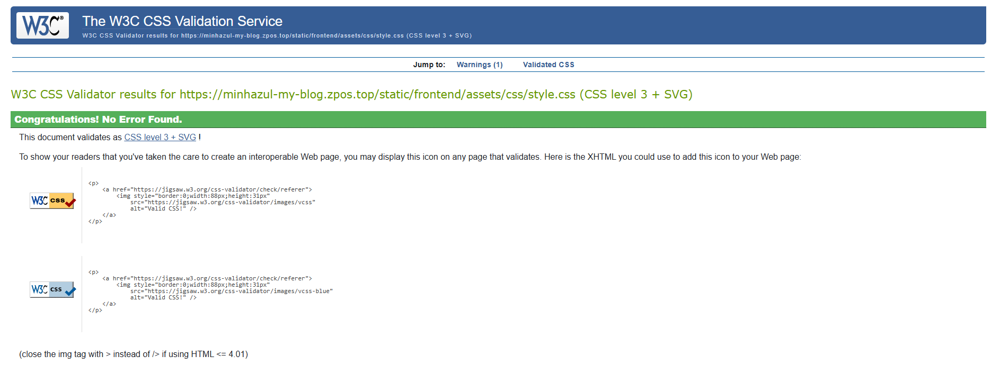

# Testing

[Return to README.md](README.md)

---

## Code Validation

All HTML and Django template files were validated with [W3C HTML Validator](https://validator.w3.org).

| Page           | Template File                 | Screenshot                           |
| -------------- | ---------------------------- | ------------------------------------ |
| Home           | `templates/pages/index.html`        |  |
| Category       | `templates/pages/category.html`     |  |
| Blog Details   | `templates/pages/blog_detail.html`  |  |
| About          | `templates/pages/about.html`        |  |
| Search         | `templates/pages/search.html`       |  |

### CSS Validation

The project uses a single global CSS file validated with [W3C CSS Validator](https://jigsaw.w3.org/css-validator).

| CSS File                                | Template Files                                                                                   | Screenshot                                         |
| --------------------------------------- | ------------------------------------------------------------------------------------------------ | -------------------------------------------------- |
| `static/frontend/assets/css/style.css`  | `index.html`, `category.html`, `blog_detail.html`, `about.html`, `search.html` (all in `templates/pages/`) |  |

### JS Validation  

The project’s JavaScript was validated with [JSHint](https://jshint.com/).  

| Location                  | File / Template                        | Screenshot                                         |  
| -------------------------- | -------------------------------------- | ------------------------------------------------- |  
| `static/frontend/assets/js` | `script.js` (global JavaScript file)   |   |  
| `templates/pages`          | `blog_detail.html` (inline JavaScript) |  |  

### PEP8 Validation

The project’s Python code was validated to ensure it follows the **PEP8** style guidelines for readability and consistency. Validation was performed using the **PEP8 Online** code checker.

| Location        | File / Module | Screenshot |
|-----------------|---------------|------------|
| `frontend`  | `view.py` |  |
| `frontend`  | `urls.py` |  |
| `post`  | `models.py` |  |
| `post`  | `admin.py` |  |

All Python files were checked to confirm they comply with **PEP8 standards**, including:

- Proper indentation and spacing
- Correct line length
- Consistent naming conventions for variables, functions, and classes
- Removal of unused imports and variables

The results confirmed that the Python codebase follows **PEP8 guidelines**, helping maintain clean, readable, and maintainable code throughout the project.

---

## Responsiveness

Tested on desktop, tablet, and mobile devices.

| Page         | Desktop                                                                 | Mobile                                                                 | Tablet                                                                 |
|--------------|-------------------------------------------------------------------------|------------------------------------------------------------------------|------------------------------------------------------------------------|
| Home         |    |    |    |
| Category     | | | |
| Blog Details | | | |
| Page         |         |         |         |

---

## Browser Compatibility

Tested on Chrome, Firefox, and Safari.

| Page        | Chrome                                         | Firefox                                       | Safari                                         | Notes             |
| ----------- | ---------------------------------------------- | --------------------------------------------- | ---------------------------------------------- | ----------------- |
| Home        |    |     |    | Works as expected |
| Category    |     |      |     | Works as expected |
| Blog Detail |  |  |  | Works as expected |
| About       |   |    |   | Works as expected |

---

## Lighthouse Audit

Audited with Lighthouse for performance, accessibility, SEO, and best practices.

| Page        | Desktop Screenshot                                                        | Mobile Screenshot                                                        |
| ----------- | ------------------------------------------------------------------------- | ------------------------------------------------------------------------- |
| Home        |            |            |
| Category    |    |    |
| Blog Detail |  |  |
| About/Contact us/Privacy Policy       |           |           |
| Search      |        |        |

---

## Defensive Programming

| Feature        | Expectation                        | Test                           | Result                 | Screenshot                                                                                  |
| -------------- | ---------------------------------- | ------------------------------ | ---------------------- | ------------------------------------------------------------------------------------------- |
| Navigation bar | Adaptive on all devices            | Tested desktop, tablet, mobile | Works consistently     |   |
| Comment form   | Blocks empty or invalid submission | Submitted empty fields         | Error prompt displayed |                                            |
| Blog slider    | Shows latest posts        | Checked posts updated          | Works as expected      |                                                     |
| Search modal   | Opens and filters content          | Tested search terms            | Results correct        |   |
| External links | Open in new tab                    | Clicked social links           | Works as expected      |   |

---

## User Story Testing

| Target  | Expectation                 | Outcome                                 | Screenshot                                 |
| ------- | --------------------------- | --------------------------------------- | ------------------------------------------ |
| Visitor | View posts by category      | Can browse category pages               |   |
| Visitor | See most viewed/editor's choice posts | most viewed/editor's choice displayed                |   |
| User    | Comment with edit/delete    | Works with email verification           |   |
| Admin   | CRUD posts                  | Create, edit, remove posts successfully |   |
---

## Bugs

* **Navigation overlap on mobile**
  Fix: CSS media queries → Fixed

* **Blog slider broke on small screens**
  Fix: Adjusted width and flex layout → Fixed

* **Comment system not blocking invalid input**
  Fix: Added validation logic → Fixed

* **Some external links not opening in new tab**
  Fix: Added `target="_blank"` → Fixed

* **Data Based link Issues related to port at MAMP**
  Fix: Changed Port Number from 3600 to 8889  → Fixed

  
---

## Known Issues

* None identified currently. All known bugs fixed. 
